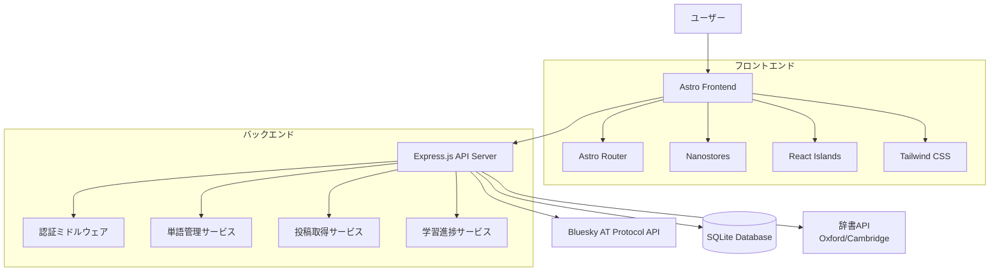

---

## 要件定義書・タスクリスト要約

### 要件定義書（主要要件）

1. **ユーザー認証とBluesky連携**
  - Blueskyアカウントでログイン、API認証、セッション維持
2. **投稿データの取得と表示**
  - 投稿取得・表示、単語の色分け、取得件数指定、エラー表示
3. **単語管理機能**
  - 未知単語の保存・詳細表示、ステータス変更、並び替え・削除
4. **単語学習機能**
  - 単語詳細（意味・例文・発音）、クイズ、進捗更新、自動ステータス更新
5. **学習進捗の可視化**
  - 統計グラフ、履歴、目標管理、進捗バー
6. **データの永続化とバックアップ**
  - DB保存、タイムスタンプ、エクスポート、エラーハンドリング
7. **レスポンシブWebインターフェース**
  - モバイル最適化、タッチ・キーボード対応、レイアウト調整

### タスクリスト（フェーズ別抜粋）

#### フェーズ1: 基本機能
- Bluesky認証・セッション管理
- 投稿取得・単語抽出・色分け表示
- 単語保存・ステータス管理

#### フェーズ2: 学習・進捗機能
- クイズ機能・進捗更新
- 統計グラフ・履歴表示
- 目標設定・進捗バー

#### フェーズ3: 高度な機能・UI改善
- データエクスポート・バックアップ
- モバイル対応・レスポンシブUI
- Expo/Next.jsによるクロスプラットフォーム化

---
# 設計書

## 概要

Bluesky LangAppは、モダンなWebアプリケーションアーキテクチャを採用し、Astroベースの高速なフロントエンドとNode.js/Express.jsベースのバックエンドAPIで構成されます。Astroのアイランドアーキテクチャにより、必要な部分のみをインタラクティブにし、優れたパフォーマンスを実現します。Bluesky APIとの連携により言語学習機能を提供します。

### Astro採用の利点

- **高速なページロード**: 静的サイト生成により初期表示が高速
- **アイランドアーキテクチャ**: 必要な部分のみJavaScriptを読み込み
- **フレームワーク非依存**: React、Vue、Svelteを必要に応じて混在可能
- **SEO最適化**: サーバーサイドレンダリングによる検索エンジン最適化
- **軽量**: 最小限のJavaScriptバンドルサイズ

## アーキテクチャ

### システム全体構成



### 技術スタック

**フロントエンド:**

- Astro + TypeScript (静的サイト生成 + インタラクティブコンポーネント)
- React/Vue/Svelte (必要に応じてアイランドアーキテクチャで使用)
- Nanostores (軽量状態管理)
- Astro Router (ルーティング)
- Tailwind CSS または UnoCSS (スタイリング)
- Chart.js (グラフ表示)

**バックエンド:**

- Node.js + Express.js
- TypeScript
- SQLite (開発環境) / PostgreSQL (本番環境)
- Prisma ORM
- JWT (認証)
- @atproto/api (Bluesky API)

## コンポーネントとインターフェース

### フロントエンドコンポーネント構造（Astro）

```
src/
├── components/
│   ├── common/
│   │   ├── Header.astro
│   │   ├── Navigation.astro
│   │   └── LoadingSpinner.astro
│   ├── auth/
│   │   ├── LoginForm.tsx (React Island)
│   │   └── ProtectedRoute.astro
│   ├── posts/
│   │   ├── PostList.astro
│   │   ├── PostItem.astro
│   │   └── WordHighlighter.tsx (React Island)
│   ├── words/
│   │   ├── WordList.astro
│   │   ├── WordCard.astro
│   │   ├── WordDetail.tsx (React Island)
│   │   └── WordStatusBadge.astro
│   ├── learning/
│   │   ├── QuizContainer.tsx (React Island)
│   │   ├── QuizQuestion.tsx (React Island)
│   │   └── ProgressChart.tsx (React Island)
│   └── dashboard/
│       ├── Dashboard.astro
│       ├── StatsOverview.astro
│       └── RecentActivity.astro
├── pages/
│   ├── index.astro (ログインページ)
│   ├── dashboard.astro
│   ├── posts.astro
│   ├── words.astro
│   ├── learning.astro
│   └── progress.astro
├── stores/
│   ├── auth.ts (Nanostores)
│   ├── posts.ts (Nanostores)
│   ├── words.ts (Nanostores)
│   └── learning.ts (Nanostores)
├── services/
│   ├── api.ts
│   ├── authService.ts
│   ├── postsService.ts
│   └── wordsService.ts
├── types/
│   ├── auth.ts
│   ├── posts.ts
│   ├── words.ts
│   └── learning.ts
└── layouts/
    ├── BaseLayout.astro
    └── AuthLayout.astro
```

### バックエンドAPI構造

```
src/
├── controllers/
│   ├── authController.ts
│   ├── postsController.ts
│   ├── wordsController.ts
│   └── learningController.ts
├── services/
│   ├── blueskyService.ts
│   ├── wordService.ts
│   ├── dictionaryService.ts
│   └── learningService.ts
├── models/
│   ├── User.ts
│   ├── Word.ts
│   ├── Post.ts
│   └── LearningSession.ts
├── middleware/
│   ├── auth.ts
│   ├── validation.ts
│   └── errorHandler.ts
├── routes/
│   ├── auth.ts
│   ├── posts.ts
│   ├── words.ts
│   └── learning.ts
└── utils/
    ├── textProcessor.ts
    ├── wordExtractor.ts
    └── logger.ts
```

### API エンドポイント設計

**認証関連:**

- `POST /api/auth/login` - Blueskyログイン
- `POST /api/auth/logout` - ログアウト
- `GET /api/auth/me` - 現在のユーザー情報取得

**投稿関連:**

- `GET /api/posts` - ユーザーの投稿取得
- `GET /api/posts/:id` - 特定投稿の詳細取得

**単語関連:**

- `GET /api/words` - 保存済み単語一覧取得
- `POST /api/words` - 新しい単語保存
- `PUT /api/words/:id` - 単語ステータス更新
- `DELETE /api/words/:id` - 単語削除
- `GET /api/words/:word/definition` - 単語の意味取得

**学習関連:**

- `GET /api/learning/quiz` - クイズ問題取得
- `POST /api/learning/quiz/answer` - クイズ回答送信
- `GET /api/learning/progress` - 学習進捗取得
- `GET /api/learning/stats` - 学習統計取得

## データモデル

### データベーススキーマ

```sql
-- ユーザーテーブル
CREATE TABLE users (
    id INTEGER PRIMARY KEY AUTOINCREMENT,
    bluesky_id VARCHAR(255) UNIQUE NOT NULL,
    display_name VARCHAR(255),
    avatar_url TEXT,
    created_at DATETIME DEFAULT CURRENT_TIMESTAMP,
    updated_at DATETIME DEFAULT CURRENT_TIMESTAMP
);

-- 単語テーブル
CREATE TABLE words (
    id INTEGER PRIMARY KEY AUTOINCREMENT,
    user_id INTEGER NOT NULL,
    word VARCHAR(255) NOT NULL,
    status ENUM('unknown', 'learning', 'known') DEFAULT 'unknown',
    definition TEXT,
    example_sentence TEXT,
    pronunciation TEXT,
    difficulty_level INTEGER DEFAULT 1,
    first_encountered_at DATETIME DEFAULT CURRENT_TIMESTAMP,
    last_reviewed_at DATETIME,
    review_count INTEGER DEFAULT 0,
    correct_count INTEGER DEFAULT 0,
    created_at DATETIME DEFAULT CURRENT_TIMESTAMP,
    updated_at DATETIME DEFAULT CURRENT_TIMESTAMP,
    FOREIGN KEY (user_id) REFERENCES users(id),
    UNIQUE(user_id, word)
);

-- 投稿テーブル（キャッシュ用）
CREATE TABLE posts (
    id INTEGER PRIMARY KEY AUTOINCREMENT,
    user_id INTEGER NOT NULL,
    bluesky_post_id VARCHAR(255) UNIQUE NOT NULL,
    content TEXT NOT NULL,
    posted_at DATETIME NOT NULL,
    processed_at DATETIME DEFAULT CURRENT_TIMESTAMP,
    FOREIGN KEY (user_id) REFERENCES users(id)
);

-- 学習セッションテーブル
CREATE TABLE learning_sessions (
    id INTEGER PRIMARY KEY AUTOINCREMENT,
    user_id INTEGER NOT NULL,
    session_type ENUM('quiz', 'review') NOT NULL,
    started_at DATETIME DEFAULT CURRENT_TIMESTAMP,
    completed_at DATETIME,
    total_questions INTEGER DEFAULT 0,
    correct_answers INTEGER DEFAULT 0,
    FOREIGN KEY (user_id) REFERENCES users(id)
);

-- 学習記録テーブル
CREATE TABLE learning_records (
    id INTEGER PRIMARY KEY AUTOINCREMENT,
    session_id INTEGER NOT NULL,
    word_id INTEGER NOT NULL,
    question_type ENUM('meaning', 'usage', 'pronunciation') NOT NULL,
    user_answer TEXT,
    is_correct BOOLEAN NOT NULL,
    response_time_ms INTEGER,
    created_at DATETIME DEFAULT CURRENT_TIMESTAMP,
    FOREIGN KEY (session_id) REFERENCES learning_sessions(id),
    FOREIGN KEY (word_id) REFERENCES words(id)
);
```

### TypeScript型定義

```typescript
// 基本型定義
export interface User {
  id: number;
  blueskyId: string;
  displayName?: string;
  avatarUrl?: string;
  createdAt: Date;
  updatedAt: Date;
}

export interface Word {
  id: number;
  userId: number;
  word: string;
  status: 'unknown' | 'learning' | 'known';
  definition?: string;
  exampleSentence?: string;
  pronunciation?: string;
  difficultyLevel: number;
  firstEncounteredAt: Date;
  lastReviewedAt?: Date;
  reviewCount: number;
  correctCount: number;
  createdAt: Date;
  updatedAt: Date;
}

export interface Post {
  id: number;
  userId: number;
  blueskyPostId: string;
  content: string;
  postedAt: Date;
  processedAt: Date;
  words?: ProcessedWord[];
}

export interface ProcessedWord {
  text: string;
  status: 'unknown' | 'learning' | 'known';
  startIndex: number;
  endIndex: number;
}

export interface LearningSession {
  id: number;
  userId: number;
  sessionType: 'quiz' | 'review';
  startedAt: Date;
  completedAt?: Date;
  totalQuestions: number;
  correctAnswers: number;
}

export interface QuizQuestion {
  id: number;
  word: Word;
  questionType: 'meaning' | 'usage' | 'pronunciation';
  question: string;
  options?: string[];
  correctAnswer: string;
}
```

## エラーハンドリング

### フロントエンドエラーハンドリング

```typescript
// エラー境界コンポーネント
class ErrorBoundary extends React.Component {
  // 予期しないエラーをキャッチし、フォールバックUIを表示
}

// APIエラーハンドリング
const apiErrorHandler = (error: AxiosError) => {
  switch (error.response?.status) {
    case 401:
      // 認証エラー - ログイン画面にリダイレクト
      break;
    case 403:
      // 権限エラー - エラーメッセージ表示
      break;
    case 500:
      // サーバーエラー - 再試行オプション提供
      break;
    default:
      // その他のエラー - 汎用エラーメッセージ
  }
};
```

### バックエンドエラーハンドリング

```typescript
// グローバルエラーハンドラー
const errorHandler = (err: Error, req: Request, res: Response, next: NextFunction) => {
  logger.error(err.stack);
  
  if (err instanceof ValidationError) {
    return res.status(400).json({ error: 'Validation failed', details: err.details });
  }
  
  if (err instanceof AuthenticationError) {
    return res.status(401).json({ error: 'Authentication required' });
  }
  
  if (err instanceof BlueskyAPIError) {
    return res.status(502).json({ error: 'External service unavailable' });
  }
  
  res.status(500).json({ error: 'Internal server error' });
};
```

## テスト戦略

### フロントエンドテスト

- **単体テスト:** Jest + React Testing Library
  - コンポーネントの動作テスト
  - Redux storeのテスト
  - ユーティリティ関数のテスト

- **統合テスト:** Cypress
  - ユーザーフローのE2Eテスト
  - API連携のテスト

### バックエンドテスト

- **単体テスト:** Jest + Supertest
  - APIエンドポイントのテスト
  - サービス層のテスト
  - データベース操作のテスト

- **統合テスト:**
  - Bluesky API連携のテスト
  - データベース統合テスト


### テストカバレッジ目標

- フロントエンド: 80%以上
- バックエンド: 85%以上
- 重要な機能（認証、単語管理、学習機能）: 95%以上

---

## Next.js + Expo 構成案と移行戦略

### 概要
Web版をNext.js（Reactベース）で再構築し、Expo（React Native for Web）とUI部品・ロジックを最大限共有する。バックエンドAPIはExpress.js（現状維持）。モバイルアプリはExpo（React Native）で開発。

### ディレクトリ構成例

```
bluesky-langapp/
├── backend/         # Express.js API
├── web/             # Next.js Webアプリ
│   ├── pages/
│   ├── components/  # UI部品（Web/Expo共通化可能）
│   ├── hooks/       # ロジック（Web/Expo共通化可能）
│   ├── styles/
│   └── ...
├── mobile/          # Expo（React Native）アプリ
│   ├── components/  # UI部品（Web/Expo共通化可能）
│   ├── screens/
│   ├── hooks/       # ロジック（Web/Expo共通化可能）
│   └── ...
└── shared/          # 共通ロジック・型・APIクライアント
```

### 技術スタック
- Web: Next.js + React + Tailwind CSS
- Mobile: Expo + React Native + React Native for Web
- 共通: TypeScript, Zustand/Recoil（状態管理）, Axios（API通信）

### UI部品・ロジックの共通化
- `shared/components/`や`shared/hooks/`にWeb/Expo両対応のReactコンポーネント・ロジックを配置
- Next.jsとExpoでimportして利用

### API連携
- Express.js APIはWeb/モバイル両方からfetch/axiosで利用
- 認証・投稿取得・単語管理・学習進捗などのAPIは共通

### 段階的移行手順
1. **Astro→Next.jsへのWeb移行**
  - 既存Astroのページ・コンポーネントをNext.jsの`pages/`や`components/`へ移植
  - SSR/静的生成はNext.jsで対応可能
2. **UI部品の共通化**
  - Web/Expo両対応のReactコンポーネント設計（スタイリングはTailwind CSS + twin.macro等で統一）
  - ロジック（hooks, stores）も共通化
3. **Expo（React Native）アプリ新規開発**
  - `mobile/`ディレクトリでExpoプロジェクト作成
  - 共通部品・ロジックをimportして開発効率化
4. **APIクライアントの共通化**
  - `shared/api.ts`などでAPI通信ロジックを共通化
5. **段階的リリース**
  - まずNext.js Web版をリリース
  - UI部品・ロジックの共通化を進めつつExpoアプリ開発
  - 並行してAPIの拡張・認証・永続化等を強化

### 補足
- Next.jsはSSR/PWA/SEOに強く、Web版の品質向上
- Expoでモバイルアプリの開発・配布が容易
- Web/モバイル両対応のUI/ロジックを最大限共有できる

---
